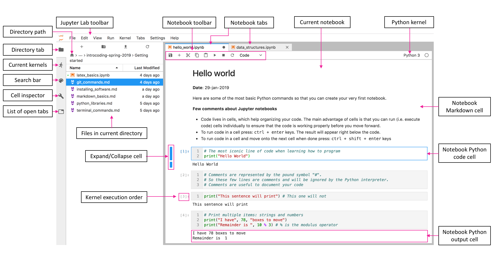

# Reproducible Research

The core principle of reproducible research is to supplement published studies not only with datasets from field or lab observations, model outputs, or instrument readings, but also with the code used in data analysis. This ensures that others can validate and replicate the findings of the study.

One of the primary benefits of utilizing a high-level programming language is its capacity to handle data in a cross-platform format, like `.txt` or `.csv`. This allows for seamless integration of various tasks, including data wrangling, numerical and statistical analyses, geospatial analyses, and the creation of publication-quality visuals within a single coding environment. Essentially, the aim is to centralize all stages of data analysis on one platform. By using code to document our thought processes and methodologies, we can reduce or even eliminate the reliance on multiple specialized software programs, thereby enhancing the transparency of our research.

::: {.callout-note}
## Note
Have you ever counted the number of mouse clicks and keyboard strokes needed to redo an entire data analysis for a manuscript when juggling between several software applications?
:::

Here are my top three reproducible research practices for research:

1. **Avoid manipulation of raw data**: This includes adding/removing/editing raw data in files created by dataloggers, data retrieved from online sources, or field/lab spredsheets. If you are copy-pasting data, you are probably doing it wrong. The idea is to handle tasks like replacing missing values, removing outliers, and skipping unnecesary data with a programming language. An exception may be if the file was corrupted (say by a malfunctioning datalogger) that prevents us from reading the file.

2. **Document and structure your code so that is human-readable**: This step requires adding comments to lines of code, making use of white space or cells to break down the code into smaller sections, add equations with reference to papers, books, or manuals, and document the code with additional explanations, equations, and figures using markdown. 

3. **Provide public access to the data and associated code**:

    - by using a dedicated version-control platforms for creating and sharing code like Github and Gitlab. Even tools like Dropbox and OneDrive are a step forward for making your research findings reproducible if you don't feel comfortable with other platforms,
 
    - uploading files to a general-purpose open-access repository like Zenodo, which also generates a digital object identifier (DOI) that can be used in future citations,
 
    - by hosting the datasets and code in your own research website.

## Jupyter Notebooks

A Jupyter notebook is a web-based environment for interactive computing. Jupyter notebooks seamlessly aggregate executable code, comments, equations, images, references, and paths or URL links to specific datasets within a single platform. In a Jupyter notebook, the code is neatly compartmentalized into cells, offering an organized and intuitive structure for coding. These cells are the cornerstone of a Jupyter Notebook's functionality, allowing for the execution of individual code segments (activated by pressing `ctrl + enter`) independently. This feature enables coders to test and validate each block of code separately, ensuring its functionality and correctness before proceeding to subsequent sections. This modular approach to code execution not only enhances the debugging process but also improves the overall development workflow.

 

## References and recommended reading

Guo, P., 2013. Helping scientists, engineers to work up to 100 times faster. [Link](https://dl.acm.org/doi/10.1145/2507771.2507775)

Shen, H., 2014. Interactive notebooks: Sharing the code. Nature, 515(7525), pp.151-152. [Link](https://www.nature.com/news/interactive-notebooks-sharing-the-code-1.16261)

Sandve, G.K., Nekrutenko, A., Taylor, J. and Hovig, E., 2013. Ten simple rules for reproducible computational research. PLoS computational biology, 9(10). [Link](https://doi.org/10.1371/journal.pcbi.1003285)

Skaggs, T.H., Young, M.H. and Vrugt, J.A., 2015. Reproducible research in vadose zone sciences. Vadose Zone Journal, 14(10). [Link](https://doi.org/10.2136/vzj2015.06.0088)

## Reproducible research questions

Based on the reading of Guo 2013 and Skaggs et al., 2015, answer the following questions:

**Q1. List and briefly explain all the softwares that you used in the past 3 years for data analysis as part of your research.**

**Q2. Briefly define what is reproducible research?**

**Q3. Name 3 reasons why you need to learn coding as a scientist or engineer.**

**Q4. How do you feel about sharing your data and code with the rest of the scientific community when publishing an article? Do you have any concerns?**